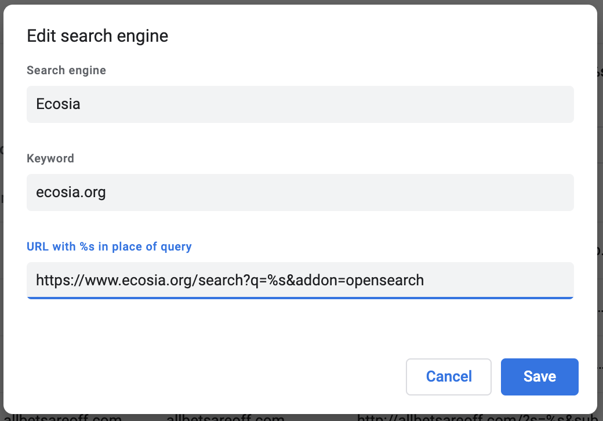
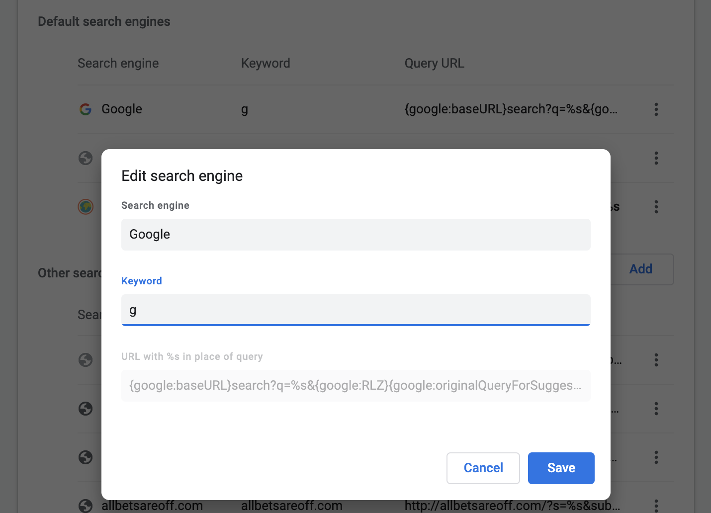
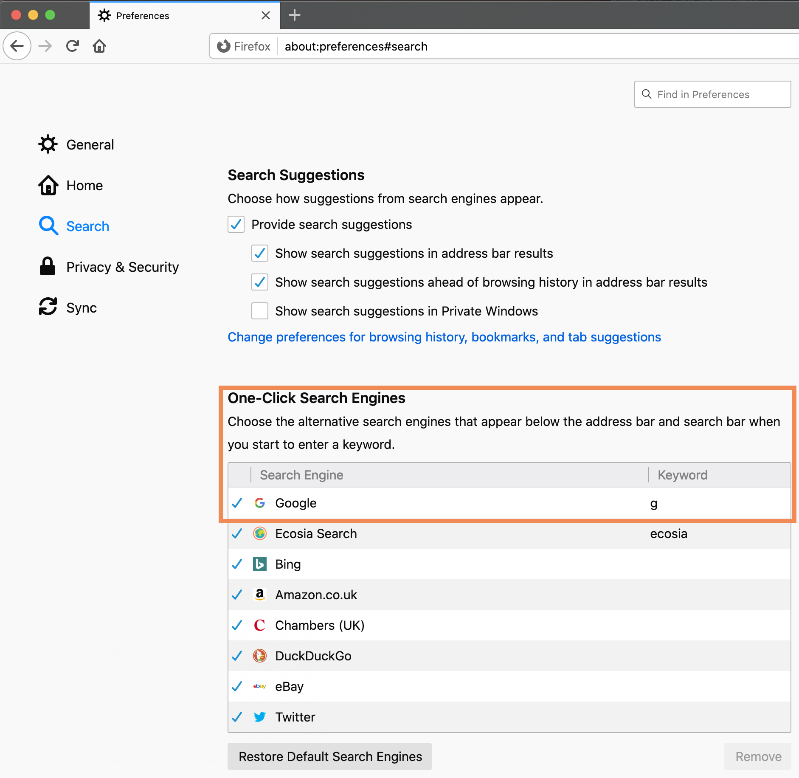

^ The result. Make Ecosia your default search engine and add g  as a keyword to get to Google.

- - -

## What is Ecosia?

Ecosia is a search engine that makes your searches work for the environment. The company behind it is a B-Corp non-profit organisation based in Berlin who invest all their profits into planting trees 🌳 around the world (so make sure you whitelist them on your ad blocker!)

## The problem

You wanna use Ecosia, but you can’t get away from needing Google sometimes.
Ecosia uses Bing under the hood so the search results already great in their own right, but sometimes you just can’t be Google. As a developer, Google is one of the most important tools in the toolkit and nothing else quite compares. So, if you’re like me and want to use Ecosia as much as possible but want to be able to quickly fall back to Google for those more specific searches, this tip is for you.

## A solution

My solution to this problem is to make Ecosia my default search engine and then make Google available by the keyword g. This way, your searches in the Chrome (or Firefox) omnibar will always use Ecosia by default, but typing g followed by TAB will switch you over to Google, giving you an ultra fast fallback to the search king. Here’s the steps (it’s quick and easy):

#### Chrome

##### Step 1: Set Ecosia as your default search engine.

There’s a few ways to do this:

* ***Method 1:*** 
  Chrome is about to release an imminent update that adds Ecosia as an option directly in your search engine settings 👏. It’s not quite here at time of writing but might be if you’re reading this later. If it is, you should see Ecosia as option when you head to:
  `Settings → Search engine → dropdown menu`

  
* ***Method 2:***
  Install the Ecosia extension for Chrome. This will automatically set your search engine to Ecosia and also set your ‘new tab’ display to an Ecosia page.
* ***Method 3:***
  I prefer to keep a different ‘new tab’ page, so while the update for Chrome isn’t here (method 1), I have manually added Ecosia as a custom search engine. Here’s how:
  Go to `Settings → Search engine → Manage search engines`

  Look in the list of ‘Other search engines’, if you’ve used Ecosia before, it might already be available, if so, click the ‘3 dots’ menu button and choose ‘Make default’.
  Screenshot 2020-05-21 at 18.46.39.png
  If it’s not in the list, click the ‘Add’ button and enter the following:
  Search engine: Ecosia 
  Keyword: ecosia.org 
  URL: https://www.ecosia.org/search?q=%s&addon=opensearch

  

  Make sure that’s your default, and you’re good to go.

##### Step 2: Set the g keyword for Google search

From the same ‘manage search engines’ settings page (Settings → Search engine → Manage search engines ), click the ‘3 dot’ menu for the Google search engine and change the keyboard value to g. This allows you to simply type g followed by TAB to get to Google search.

And you’re done! It should now function like the gif at the top of this post. Enjoy.

#### Firefox

The setup for Firefox takes the same principles as Chrome, but if anything it’s slightly easier, I won’t go into detail here.

##### Step 1: Set Ecosia as the default browser

You can install the Ecosia extension for Firefox to take care of this.

##### Step 2: Set the keyword for Google to g

This setting can be found in Preferences → Search → One-Click Search Engines .
Find Google, double click in the ‘Keyword’ cell and type g .

And that’s it, you’re done! Firefox’s keyword usage works differently (arguably better) than Chrome’s, making a search in the omnibar will default to Ecosia and to use Google you simply start your search with g  . Wanna search for puppies on Google?
Type g puppies .

## Wrap up

I hope you found this useful and might get you to use Ecosia when otherwise you wouldn’t, it’s a fantastic tool and a great way to help the planet. 
As a developer, most of my searches are problem-solving/troubleshooting and you can’t be Google for that. But when it comes for searching for things like products, stores and companies - use Ecosia. These are the searches that give these companies revenue, and Ecosia will always get you the results you want for that. If you see what you’re after as an ad on Ecosia, click it, it helps them plant trees (even if it does take some work beating out years of muscle memory of skipping right over the ads section of Google!).